# [MS4 - The Poster Vault](https://the-poster-vault-89343956ce2e.herokuapp.com) 

Developer: Sanne Johansson ([ssannejohansson](https://www.github.com/ssannejohansson))

[](https://www.github.com/ssannejohansson/MS4/commits/main)
[](https://www.github.com/ssannejohansson/MS4/commits/main)
[](https://www.github.com/ssannejohansson/MS4)
[](https://the-poster-vault-89343956ce2e.herokuapp.com)

This is my fourth Milestone Project for Code Institute. 

The project aim was creating an online store specializing in vintage and retro posters. It aims to bring nostalgic, high-quality designs to collectors, art lovers, and anyone looking to add character to their space. By curating unique posters and providing a simple, engaging shopping experience, the store makes it easy for people to discover and enjoy timeless artwork.

I chose this theme because I wanted to do something different to my other projects and the theme allowed me to be more playful and creative with the design. 


Generated by: [Am I Responsive](https://ui.dev/amiresponsive?url=https://the-poster-vault-89343956ce2e.herokuapp.com)

## UX

### The 5 Planes of UX

#### 1. Strategy

**Purpose**
- Provide a seamless and intuitive e-commerce experience for customers to browse, filter, and purchase products.
- Empower site owners to manage the store's inventory and customer orders efficiently.

**Primary User Needs**
- Guest users need to browse products and checkout with ease.
- Registered customers need a streamlined shopping experience with account and order history features.
- Site owners need robust tools for inventory and order management.

**Business Goals**
- Drive sales by providing a user-friendly shopping experience.
- Build customer loyalty through personalized and efficient account features.
- Maintain an organized and up-to-date store inventory.

#### 2. Scope

**[Features](#features)** (see below)

**Content Requirements**
- Product details, including name, price, description, category, and images.
- Order details, confirmation pages, and email notifications.
- Secure payment processing using Stripe.
- Payment success emails sent to users.
- 404 page for lost users.

#### 3. Structure

**Information Architecture**
- **Navigation Menu**:
  - Links to Home, Products, Cart and Account sections.
- **Hierarchy**:
  - Prominent product categories and filters for easy navigation.
  - Cart and checkout options displayed prominently for convenience.

**User Flow**
1. Guest user browses the store → filters and sorts products by category, price, or name.
2. Guest user adds items to the cart → proceeds to checkout.
3. Guest user creates an account or logs in during checkout → completes purchase.
4. Returning customers log in → view past orders and track purchase history.
5. Site owners manage inventory → add, update, or delete products and categories.

#### 4. Skeleton

**[Wireframes](#wireframes)** (see below)

#### 5. Surface

**Visual Design Elements**
- **[Colours](#colour-scheme)** (see below)
- **[Typography](#typography)** (see below)

### Colour Scheme

I used [coolors](https://coolors.co/generate) to generate my color palette.

The palette is designed to feel natural and elegant. I intentionally replaced harsh black and white with a deep dark brown and a soft light cream to maintain an overall sense of warmth.


### Typography

I used the Hatolie font for the Logo to stick to the elegant feeling I went for, and to match it I used Crimson Pro on the icon texts and search bar. 

To keep in the shopping experience clean and, I then used Lato for all text.

- [Hatolie](https://www.dafont.com/hatolie.font) was used for the logo.
- [Crimson Pro](https://fonts.google.com/specimen/Crimson+Pro) was used for the navigation text on the first row.
- [Lato](https://fonts.google.com/specimen/Lato) was used for all other primary text.
- [Font Awesome](https://fontawesome.com) icons were used throughout the site, such as the social media icons in the footer.

## Wireframes

I've used [Balsamiq](https://balsamiq.com/wireframes) to design my site wireframes.

| Page |  | 
| --- | --- | 
| Home | 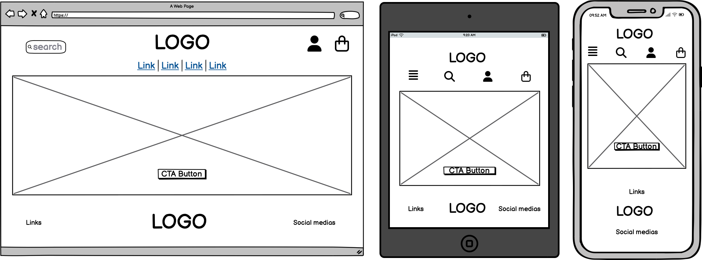 | 
| Products | 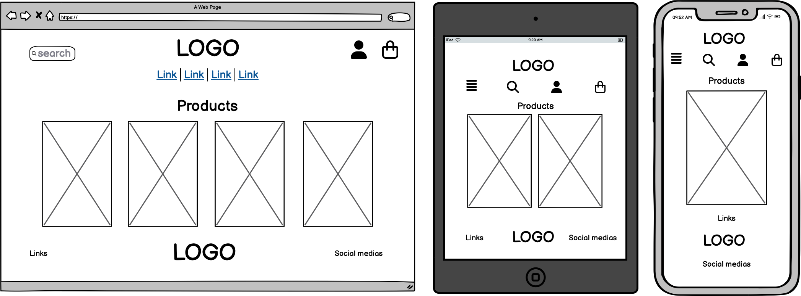 |
| Product Details | 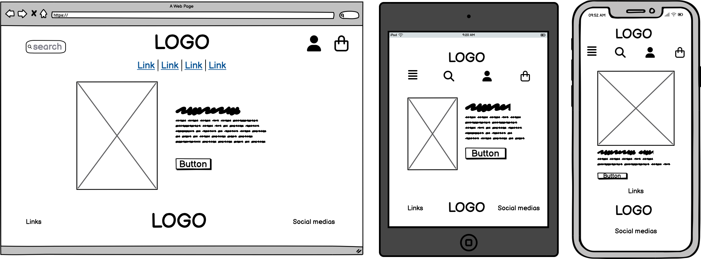 | 
| Bag | 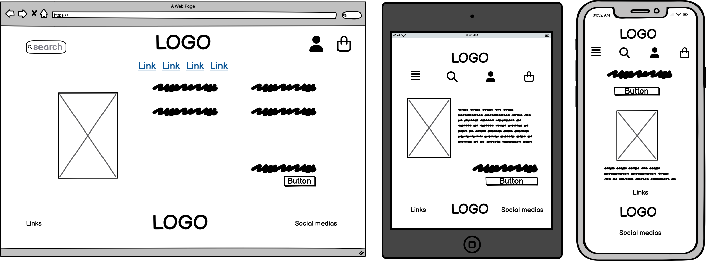 | 
| Checkout | 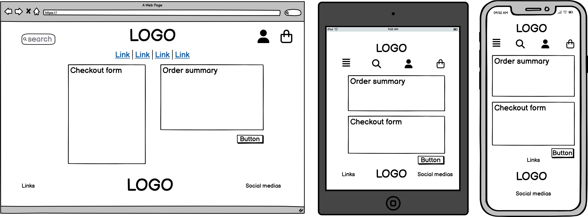 |


## User Stories

| Target | Expectation | Outcome |
| --- | --- | --- |
| As a guest user | I would like to browse products without needing to register | so that I can shop freely before deciding to create an account. |
| As a guest user | I would like to be prompted to create an account or log in at checkout | so that I can complete my purchase and track my order history. |
| As a customer | I would like to browse various product categories | so that I can easily find what I'm looking for. |
| As a customer | I would like to sort products by price (low-to-high/high-to-low) and name (alphabetical) | so that I can quickly organize items in a way that suits my shopping style. |
| As a customer | I would like to filter products by category | so that I can narrow down the products to the types I am most interested in. |
| As a customer | I would like to click on individual products to view more details (description, price, image, etc.) | so that I can make an informed decision about my purchase. |
| As a customer | I would like to add items to my shopping cart using quantity increment/decrement buttons | so that I can adjust how many units of a product I want before checkout. |
| As a customer | I would like to view and manage my shopping cart | so that I can review, add, or remove items before proceeding to checkout. |
| As a customer | I would like to adjust the quantity of items in my cart | so that I can modify my purchase preferences without leaving the cart. |
| As a customer | I would like to remove items from my cart | so that I can remove products I no longer wish to buy. |
| As a customer | I would like to proceed to checkout where I see my cart items, grand total, and input my name, email, shipping address, and card details | so that I can complete my purchase. |
| As a customer | I would like to receive a confirmation email after my purchase | so that I can have a record of my transaction and order details. |
| As a customer | I would like to see an order confirmation page with a checkout order number after completing my purchase | so that I know my order has been successfully placed. |
| As a customer | I would like to securely enter my card details using Stripe at checkout | so that I can feel confident my payment information is protected. |
| As a returning customer | I would like to be able to log in and view my past orders | so that I can track my previous purchases and order history. |
| As a returning customer | I would like the checkout process to remember my shipping address | so that future purchases are quicker and easier. |
| As a site owner | I would like to create new products with a name, description, price, images, and category | so that I can add additional items to the store inventory. |
| As a site owner | I would like to update product details (name, price, description, image, category) at any time | so that I can keep my product listings accurate and up to date. |
| As a site owner | I would like to delete products that are no longer available or relevant | so that I can maintain a clean and accurate inventory. |
| As a site owner | I would like to view all orders placed on the website | so that I can track and manage customer purchases. |
| As a site owner | I would like to manage product categories | so that I can ensure items are correctly organized and easy for customers to find. |
| As a user | I would like to see a 404 error page if I get lost | so that it's obvious that I've stumbled upon a page that doesn't exist. |

## Features

### Existing Features

| Feature | Notes | Screenshot |
| --- | --- | --- |
| Register | Authentication is handled by allauth, allowing users to register accounts. |  |
| Login | Authentication is handled by allauth, allowing users to log in to their existing accounts. | 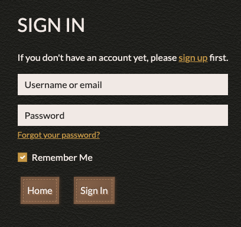 |
| Logout | Authentication is handled by allauth, allowing users to log out of their accounts. |  |
| Product List | Users can browse all available products with sorting, filtering by categories, and search functionality. | 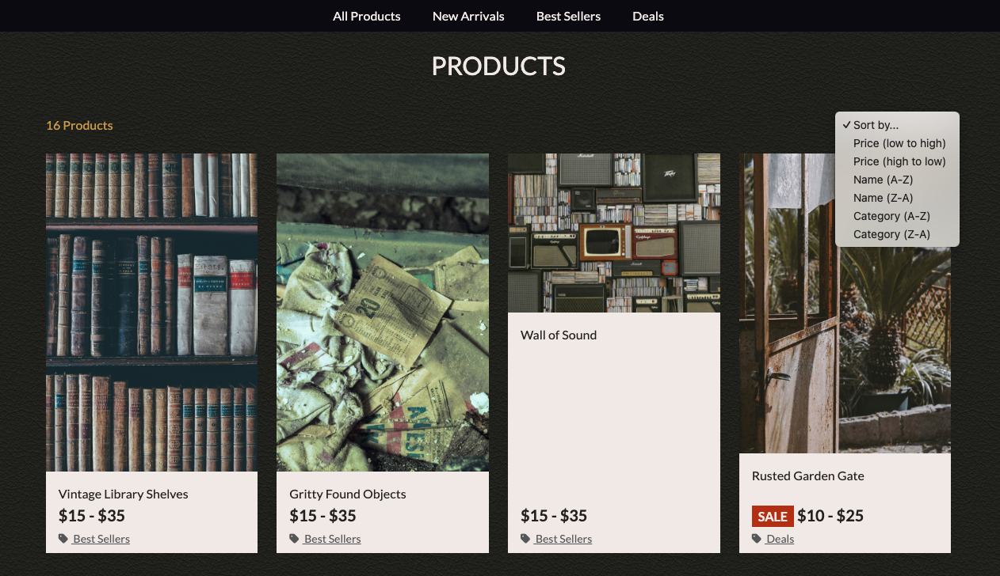 |
| Product Details | Displays detailed information about a selected product, including its name, description, price, an image, and available sizes. | 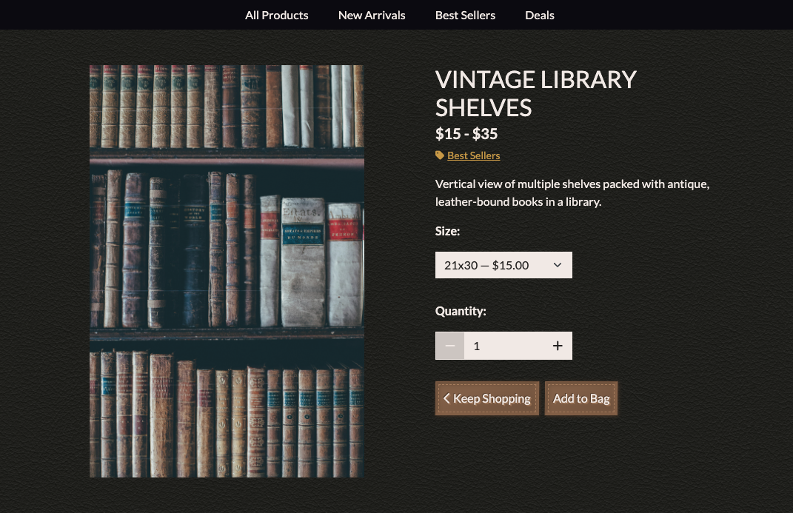 |
| Add to Bag | Users can add items to their shopping bag, with support for selecting different sizes if applicable. | 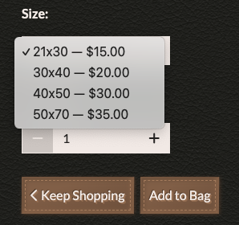 |
| View Bag | Users can view the contents of their shopping bag, adjust quantities, or remove items. | 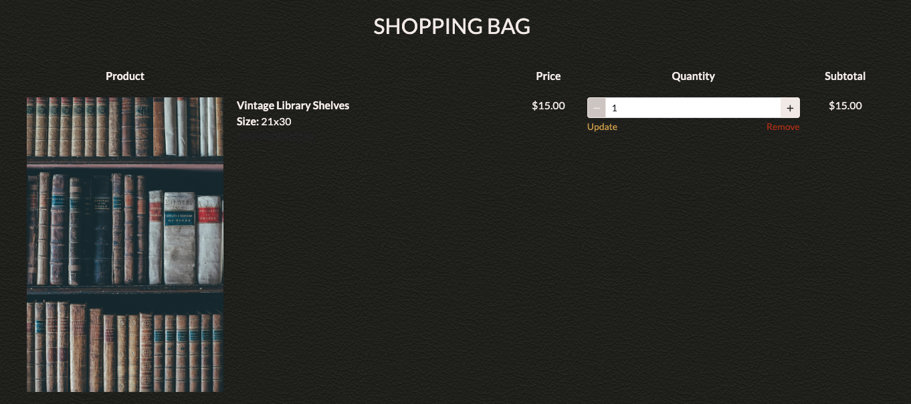 |
| Checkout | Users can proceed to checkout, where they provide their delivery details and payment information using Stripe integration. | 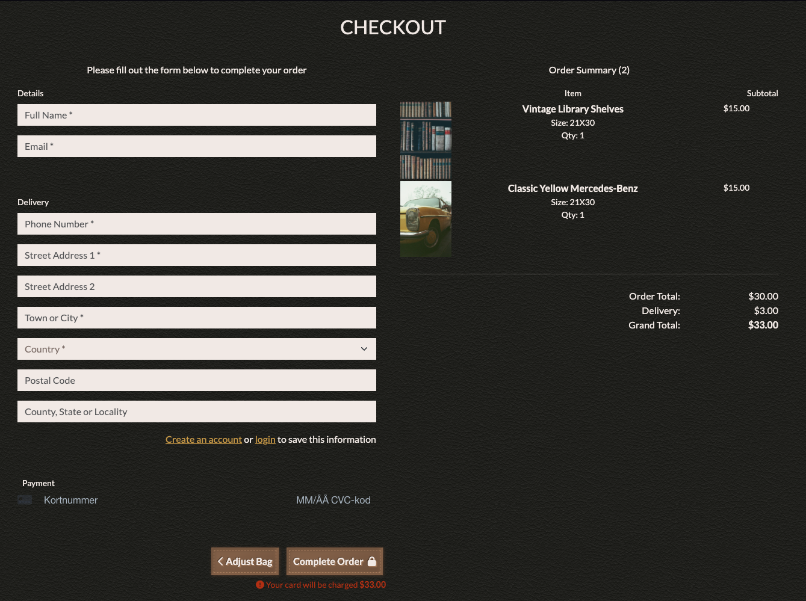 |
| Order Confirmation | Users receive an on-screen and email confirmation with details of their purchase. | 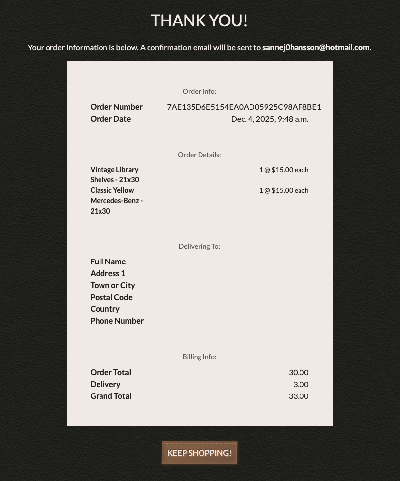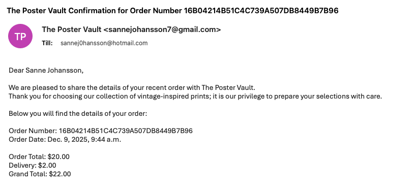 |
| Profile Management | Users can manage their profile information, including their default delivery address and order history. | 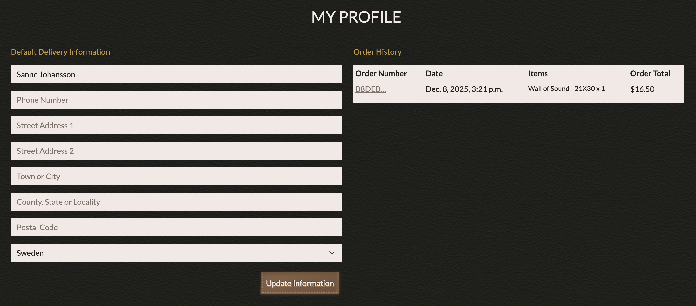 |
| Product Management | Superusers can add, edit, and delete products from the site via a CRUD interface. | 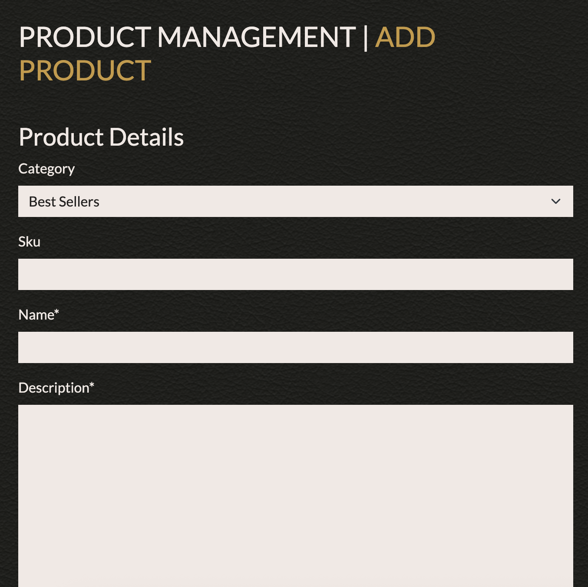 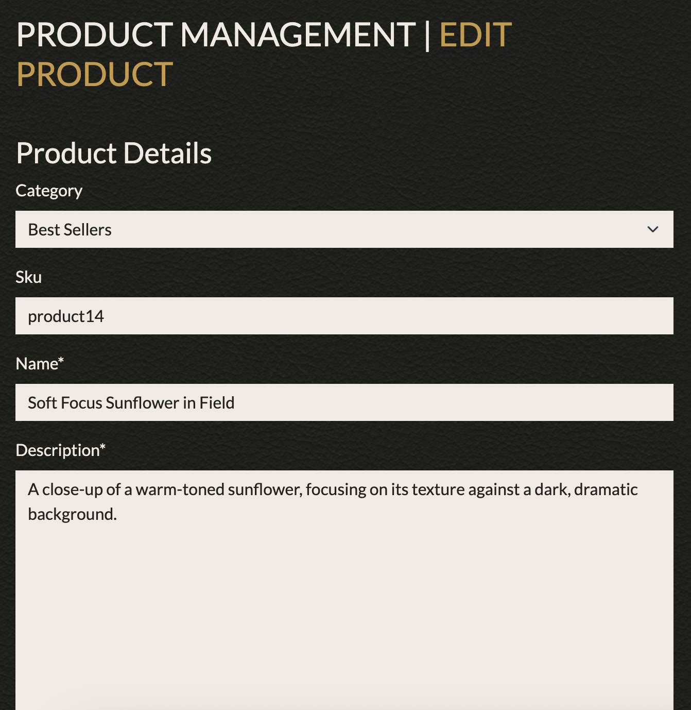 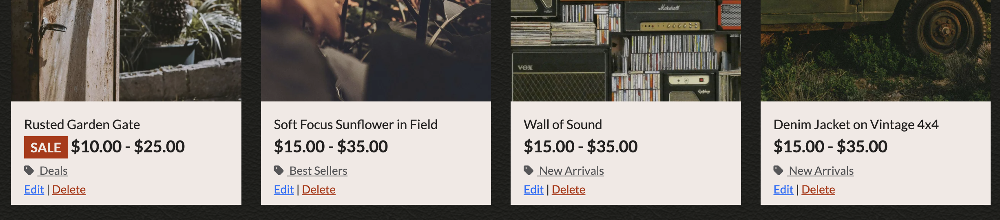 |
| Contact | Users can submit a message via the contact form | 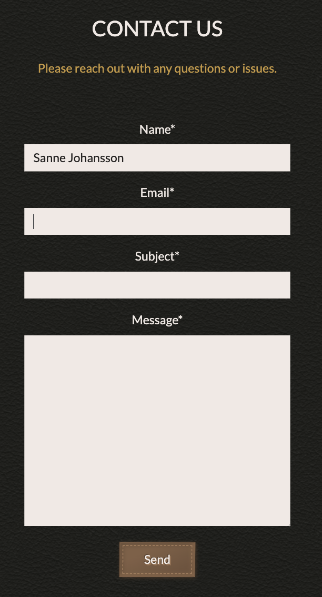 |
| User Feedback | Clear and concise Django messages are used to provide feedback to users when interacting with various features | 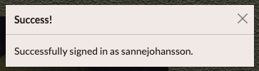 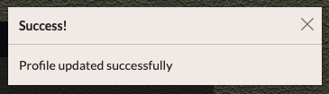 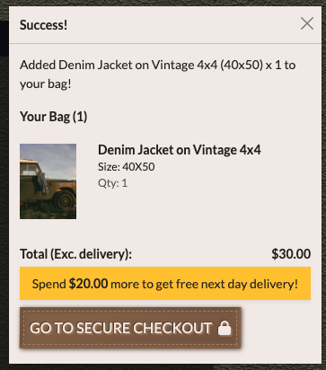 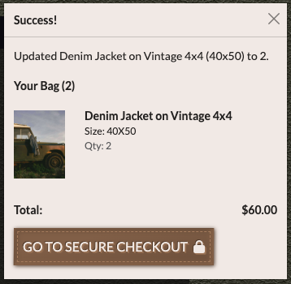 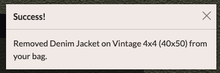 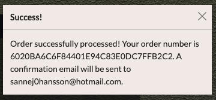 |
| 404 | The 404 error page will indicate when a user has navigated to a page that doesn't exist, replacing the default Heroku 404 page with one that ties into the site's look and feel. | 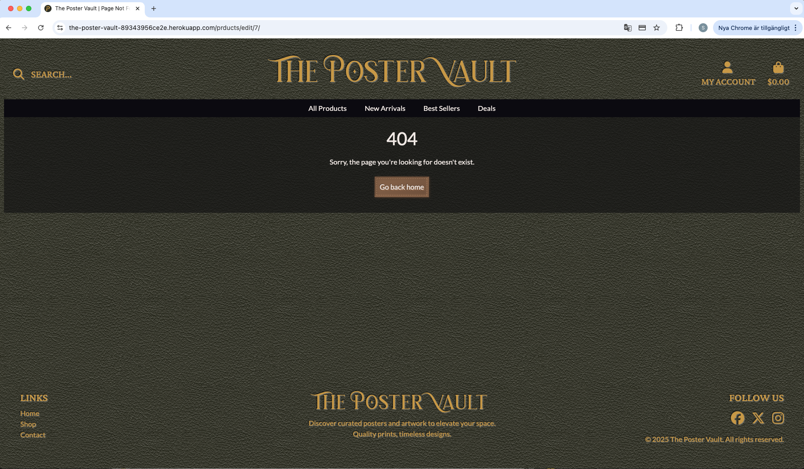 |

### Future Features

- **Wishlist Functionality**: Enable users to save products to a personal wishlist for future purchases. Notify users if wishlist items go on sale or are back in stock.

- **Discount Codes and Vouchers**: Allow the admin to create discount codes or vouchers for promotions and marketing campaigns.


## Tools & Technologies

| Tool / Tech | Use |
| --- | --- |
| [](https://markdown.2bn.dev) | Generate README and TESTING templates. |
| [Git](https://git-scm.com) | Version control. (`git add`, `git commit`, `git push`) |
| [GitHub](https://github.com) | Secure online code storage. |
| [VS Code](https://code.visualstudio.com) | Local IDE for development. |
| [CSS](https://en.wikipedia.org/wiki/CSS) | Design and layout. |
| [JavaScript](https://www.javascript.com) | User interaction on the site. |
| [Python](https://www.python.org) | Back-end programming language. |
| [Heroku](https://www.heroku.com) | Hosting the deployed back-end site. |
| [Bootstrap 5](https://getbootstrap.com) | Front-end CSS framework for modern responsiveness and pre-built components. |
| [Django](https://www.djangoproject.com) | Python framework for the site. |
| [PostgreSQL](https://www.postgresql.org) | Relational database management. |
| [Stripe](https://stripe.com) | Online secure payments of e-commerce products/services. |
| [Gmail](https://mail.google.com) | Sending emails in my application. |
| [AWS S3](https://aws.amazon.com/s3) | Online static file storage. |
| [Balsamiq](https://balsamiq.com/wireframes) | Creating wireframes. |
| [FontAwesome](https://fontawesome.com) | Icons. |
| [ChatGPT](https://chat.openai.com) | Help debug, troubleshoot, and explain things. |
| [Mermaid](https://mermaid.live) | Generate an interactive diagram for the data/schema. |
| [w3schools](https://www.w3schools.com) | Tutorials/Reference Guide |
| [Gemini](https://gemini.google.com) | Help debug, troubleshoot, and explain things. |

## Database Design

### Data Model

I have used `Mermaid` to generate an interactive ERD of my project.

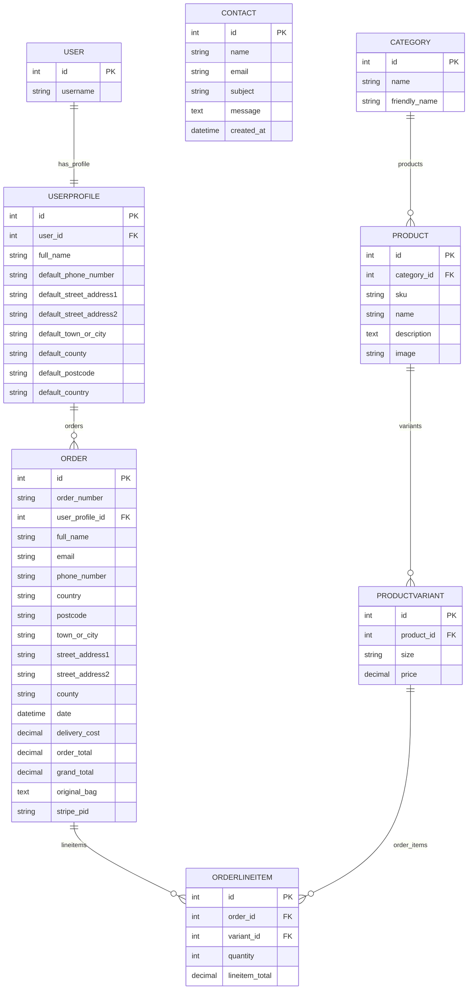
```mermaid
erDiagram

    USER {
        int id PK
        string username
    }

    USERPROFILE {
        int id PK
        int user_id FK
        string full_name
        string default_phone_number
        string default_street_address1
        string default_street_address2
        string default_town_or_city
        string default_county
        string default_postcode
        string default_country
    }

    ORDER {
        int id PK
        string order_number
        int user_profile_id FK
        string full_name
        string email
        string phone_number
        string country
        string postcode
        string town_or_city
        string street_address1
        string street_address2
        string county
        datetime date
        decimal delivery_cost
        decimal order_total
        decimal grand_total
        text original_bag
        string stripe_pid
    }

    ORDERLINEITEM {
        int id PK
        int order_id FK
        int variant_id FK
        int quantity
        decimal lineitem_total
    }

    CONTACT {
        int id PK
        string name
        string email
        string subject
        text message
        datetime created_at
    }

    CATEGORY {
        int id PK
        string name
        string friendly_name
    }

    PRODUCT {
        int id PK
        int category_id FK
        string sku
        string name
        text description
        string image
    }

    PRODUCTVARIANT {
        int id PK
        int product_id FK
        string size
        decimal price
    }

    USER ||--|| USERPROFILE : has_profile
    USERPROFILE ||--o{ ORDER : orders
    ORDER ||--o{ ORDERLINEITEM : lineitems
    PRODUCT ||--o{ PRODUCTVARIANT : variants
    PRODUCTVARIANT ||--o{ ORDERLINEITEM : order_items
    CATEGORY ||--o{ PRODUCT : products


```

source: [Mermaid](https://mermaid.live/edit#pako:eNqVVcFu2zAM_RVD57RIHLdpfRs6DBg2bB2GXYYAhmIxjlBZcimqqdvk3yfbSVPHceP5kBh8TyRFPtKvLDUCWMwAP0ueIc_nOvDPHwsYvDbv1SM1BVIE998OpieO6Ypj4DxV8xy6CORcqq654NauDYoG2c71IeQ9mqVUMDCygCV3ipJiZTQk2uULwH6WJQSghAuBYO1kKDHsJ5JZ68Rgkkoq-1mpcfojvDCWqiac8YDliXoFm83FxWbTql0crLhNfEX2xDtOkBksB1b1dC-XKEELVSYH-C0TH1m4lAb6tw_uXFCCZ_K3tynKgqTRB2RhjKrvZ-UL2INdQCpzroICZQpdM3KSOuuG9WAGicN3Kq1NzW_PNauam82hrHGwAGV0Zr0g9tyfKAYPkKm4vfJdOqWS_5uvD8ehJabWsV4dfqzzs3N1dp6OJ0T4ypLMoX7pNlOAkk-ApZ8LS124KScZ4qoL-g2nxTFYy82gzKTmKlnw7OQdZAFJIY-3Vt3o71LDV4L8TMMr06Pjmlp13KemvBPpnRxn99afRn618k8lsddlO6NmG-Rcl6fy3R3ZK7tfyTtie890yT9gbRUQDdb-Owm_3ebOaOKD18mg0ag7nHv1daf6y6dfAyM9OrDtbVS75dqu94O2ZSOWA_rgwn9Ta7dzRivwKbLYvwqOD3M21xWPOzK_S52ymNDBiLmikvvuK8ziJVfWWwuuWfzKnlk8jSaXN9ez8HoyHc_C8TiajVjJ4ovp5XUUTqMovLqdXd2Et-FsO2Ivxngfk8vxZBpGkT_m_zxW-_tbY01QNC5b7YJt_wE0ZoQj)
45
## Agile Development Process

### GitHub Projects

[GitHub Projects](https://www.github.com/ssannejohansson/MS4/projects) served as an Agile tool for this project. Through it, EPICs, User Stories, issues/bugs, and Milestone tasks were planned, then subsequently tracked on a regular basis using the Kanban project board.

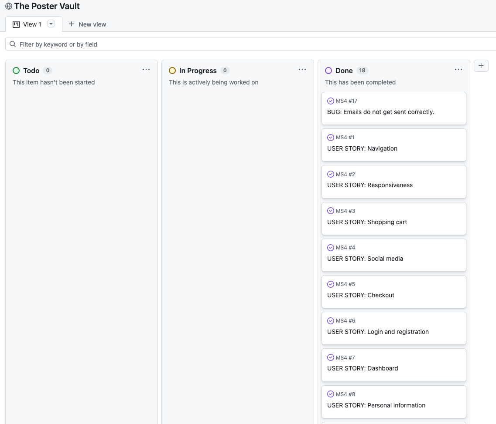

### GitHub Issues

[GitHub Issues](https://www.github.com/ssannejohansson/MS4/issues) served as an another Agile tool. There, I managed my User Stories and Milestone tasks, and tracked any issues/bugs.

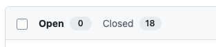

### MoSCoW Prioritization

I've decomposed my Epics into User Stories for prioritizing and implementing them. Using this approach, I was able to apply "MoSCoW" prioritization and labels to my User Stories within the Issues tab.

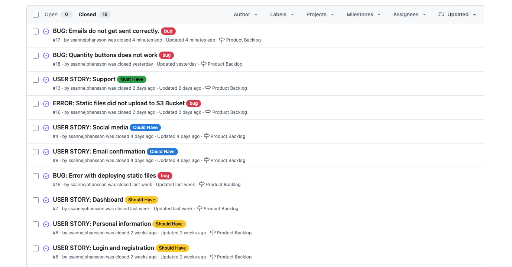

## Testing

> [!NOTE]  
> For all testing, please refer to the [TESTING.md](TESTING.md) file.

## Deployment

The live deployed application can be found deployed on [Heroku](https://the-poster-vault-89343956ce2e.herokuapp.com).

### Heroku Deployment

This project uses [Heroku](https://www.heroku.com), a platform as a service (PaaS) that enables developers to build, run, and operate applications entirely in the cloud.

Deployment steps are as follows, after account setup:

- Select **New** in the top-right corner of your Heroku Dashboard, and select **Create new app** from the dropdown menu.
- Your app name must be unique, and then choose a region closest to you (EU or USA), then finally, click **Create App**.
- From the new app **Settings**, click **Reveal Config Vars**, and set your environment variables to match your private `env.py` file.

> [!IMPORTANT]  
> This is a sample only; you would replace the values with your own if cloning/forking my repository.

| Key | Value |
| --- | --- |
| `AWS_ACCESS_KEY_ID` | user-inserts-own-aws-access-key-id |
| `AWS_SECRET_ACCESS_KEY` | user-inserts-own-aws-secret-access-key |
| `DATABASE_URL` | user-inserts-own-postgres-database-url |
| `DISABLE_COLLECTSTATIC` | 1 (*this is temporary, and can be removed for the final deployment*) |
| `EMAIL_HOST_PASS` | user-inserts-own-gmail-api-key |
| `EMAIL_HOST_USER` | user-inserts-own-gmail-email-address |
| `SECRET_KEY` | any-random-secret-key |
| `STRIPE_PUBLIC_KEY` | user-inserts-own-stripe-public-key |
| `STRIPE_SECRET_KEY` | user-inserts-own-stripe-secret-key |
| `STRIPE_WH_SECRET` | user-inserts-own-stripe-webhook-secret |
| `USE_AWS` | True |

Heroku needs some additional files in order to deploy properly.

- [requirements.txt](requirements.txt)
- [Procfile](Procfile)
- [.python-version](.python-version)

You can install this project's **[requirements.txt](requirements.txt)** (*where applicable*) using:

- `pip3 install -r requirements.txt`

If you have your own packages that have been installed, then the requirements file needs updated using:

- `pip3 freeze --local > requirements.txt`

The **[Procfile](Procfile)** can be created with the following command:

- `echo web: gunicorn app_name.wsgi > Procfile`
- *replace `app_name` with the name of your primary Django app name; the folder where `settings.py` is located*

The **[.python-version](.python-version)** file tells Heroku the specific version of Python to use when running your application.

- `3.12` (or similar)

For Heroku deployment, follow these steps to connect your own GitHub repository to the newly created app:

Either (*recommended*):

- Select **Automatic Deployment** from the Heroku app.

Or:

- In the Terminal/CLI, connect to Heroku using this command: `heroku login -i`
- Set the remote for Heroku: `heroku git:remote -a app_name` (*replace `app_name` with your app name*)
- After performing the standard Git `add`, `commit`, and `push` to GitHub, you can now type:
	- `git push heroku main`

The project should now be connected and deployed to Heroku!

### PostgreSQL

This project uses a [Code Institute PostgreSQL Database](https://dbs.ci-dbs.net) for the Relational Database with Django.

> [!CAUTION]
> - PostgreSQL databases by Code Institute are only available to CI Students.
> - You must acquire your own PostgreSQL database through some other method if you plan to clone/fork this repository.
> - Code Institute students are allowed a maximum of 8 databases.
> - Databases are subject to deletion after 18 months.

To obtain my own Postgres Database from Code Institute, I followed these steps:

- Submitted my email address to the CI PostgreSQL Database link above.
- An email was sent to me with my new Postgres Database.
- The Database connection string will resemble something like this:
    - `postgres://<db_username>:<db_password>@<db_host_url>/<db_name>`
- You can use the above URL with Django; simply paste it into your `env.py` file and Heroku Config Vars as `DATABASE_URL`.

### Amazon AWS

This project uses [AWS](https://aws.amazon.com) to store media and static files online, due to the fact that Heroku doesn't persist this type of data.

Once you've created an AWS account and logged-in, follow these series of steps to get your project connected. Make sure you're on the **AWS Management Console** page.

#### S3 Bucket

- Search for **S3**.
- Create a new bucket, give it a name (e.g. matching your Heroku app name), and choose the region closest to you.
- Uncheck **Block all public access**, and acknowledge that the bucket will be public (*required* for it to work on Heroku).
- From **Object Ownership**, make sure to have **ACLs enabled**, and **Bucket owner preferred** selected.
- From the **Properties** tab, turn on static website hosting, and type `index.html` and `error.html` in their respective fields, then click **Save**.
- From the **Permissions** tab, paste in the following CORS configuration:

	```shell
	[
		{
			"AllowedHeaders": [
				"Authorization"
			],
			"AllowedMethods": [
				"GET"
			],
			"AllowedOrigins": [
				"*"
			],
			"ExposeHeaders": []
		}
	]
	```

- Copy your **ARN** string.
- From the **Bucket Policy** tab, select the **Policy Generator** link, and use the following steps:
	- Policy Type: **S3 Bucket Policy**
	- Effect: **Allow**
	- Principal: `*`
	- Actions: **GetObject**
	- Amazon Resource Name (ARN): **paste-your-ARN-here**
	- Click **Add Statement**
	- Click **Generate Policy**
	- Copy the entire Policy, and paste it into the **Bucket Policy Editor**

		```shell
		{
			"Id": "Policy1234567890",
			"Version": "2012-10-17",
			"Statement": [
				{
					"Sid": "Stmt1234567890",
					"Action": [
						"s3:GetObject"
					],
					"Effect": "Allow",
					"Resource": "arn:aws:s3:::your-bucket-name/*"
					"Principal": "*",
				}
			]
		}
		```

	- Before you click "Save", add `/*` to the end of the Resource key in the Bucket Policy Editor (*like above*).
	- Click **Save**.
- From the **Access Control List (ACL)** section, click "Edit" and enable **List** for **Everyone (public access)**, and accept the warning box.
	- If the edit button is disabled, you need to change the **Object Ownership** section above to **ACLs enabled** (*mentioned above*).

#### IAM

Back on the AWS Services Menu, search for and open **IAM** (Identity and Access Management). Once on the IAM page, follow these steps:

- From **User Groups**, click **Create New Group**.

- Tags are optional, but you must click it to get to the **review policy** page.
- From **User Groups**, select your newly created group, and go to the **Permissions** tab.
- Open the **Add Permissions** dropdown, and click **Attach Policies**.
- Select the policy, then click **Add Permissions** at the bottom when finished.
- From the **JSON** tab, select the **Import Managed Policy** link.
	- Search for **S3**, select the `AmazonS3FullAccess` policy, and then **Import**.
	- You'll need your ARN from the S3 Bucket copied again, which is pasted into "Resources" key on the Policy.

		```shell
		{
			"Version": "2012-10-17",
			"Statement": [
				{
					"Effect": "Allow",
					"Action": "s3:*",
					"Resource": [
						"arn:aws:s3:::your-bucket-name",
						"arn:aws:s3:::your-bucket-name/*"
					]
				}
			]
		}
		```
	
	- Click **Review Policy**.
	- Provide a description:
		- "Access to S3 Bucket for ms4 static files."
	- Click **Create Policy**.
- From **User Groups**, click your group.
- Click **Attach Policy**.
- Search for the policy you've just created and select it, then **Attach Policy**.
- From **User Groups**, click **Add User**.
- For "Select AWS Access Type", select **Programmatic Access**.
- Select the group to add your new user to the group you created.
- Tags are optional, but you must click it to get to the **review user** page.
- Click **Create User** once done.
- You should see a button to **Download .csv**, so click it to save a copy on your system.
	- **IMPORTANT**: once you pass this page, you cannot come back to download it again, so do it immediately!
	- This contains the user's **Access key ID** and **Secret access key**.
	- `AWS_ACCESS_KEY_ID` = **Access key ID**
	- `AWS_SECRET_ACCESS_KEY` = **Secret access key**

#### Final AWS Setup

- If Heroku Config Vars has `DISABLE_COLLECTSTATIC` still, this can be removed now, so that AWS will handle the static files.
- Back within **S3**, create a new folder called: `media`.
- Select any existing media images for your project to prepare them for being uploaded into the new folder.
- Under **Manage Public Permissions**, select **Grant public read access to this object(s)**.
- No further settings are required, so click **Upload**.

### Stripe API

This project uses [Stripe](https://stripe.com) to handle the ecommerce payments.

Once you've created a Stripe account and logged-in, follow these series of steps to get your project connected.

- From your Stripe dashboard, click to expand the "Get your test API keys".
- You'll have two keys here:
	- `STRIPE_PUBLIC_KEY` = Publishable Key (starts with **pk**)
	- `STRIPE_SECRET_KEY` = Secret Key (starts with **sk**)

As a backup, in case users prematurely close the purchase-order page during payment, we can include Stripe Webhooks.

- From your Stripe dashboard, click **Developers**, and select **Webhooks**.
- From there, click **Add Endpoint**.
	- `https://the-poster-vault-89343956ce2e.herokuapp.com/checkout/wh/`
- Click **receive all events**.
- Click **Add Endpoint** to complete the process.
- You'll have a new key here:
	- `STRIPE_WH_SECRET` = Signing Secret (Wehbook) Key (starts with **wh**)

### Gmail API

This project uses [Gmail](https://mail.google.com) to handle sending emails to users for purchase order confirmations.

Once you've created a Gmail (Google) account and logged-in, follow these series of steps to get your project connected.

- Click on the **Account Settings** (cog icon) in the top-right corner of Gmail.
- Click on the **Accounts and Import** tab.
- Within the section called "Change account settings", click on the link for **Other Google Account settings**.
- From this new page, select **Security** on the left.
- Select **2-Step Verification** to turn it on. (*verify your password and account*)
- Once verified, select **Turn On** for 2FA.
- Navigate back to the **Security** page, and you'll see a new option called **App passwords** (*search for it at the top, if not*).
- This might prompt you once again to confirm your password and account.
- Select **Mail** for the app type.
- Select **Other (Custom name)** for the device type.
    - Any custom name, such as "Django" or `MS4`
- You'll be provided with a 16-character password (API key).
    - Save this somewhere locally, as you cannot access this key again later!
    - If your 16-character password contains *spaces*, make sure to remove them entirely.
    - `EMAIL_HOST_PASS` = user's 16-character API key
    - `EMAIL_HOST_USER` = user's own personal Gmail email address


### Local Development

This project can be cloned or forked in order to make a local copy on your own system.

For either method, you will need to install any applicable packages found within the [requirements.txt](requirements.txt) file.

- `pip3 install -r requirements.txt`.

You will need to create a new file called `env.py` at the root-level, and include the same environment variables listed above from the Heroku deployment steps.

> [!IMPORTANT]  
> This is a sample only; you would replace the values with your own if cloning/forking my repository.

Sample `env.py` file:

```python
import os

os.environ.setdefault("AWS_ACCESS_KEY_ID", "user-inserts-own-aws-access-key-id")
os.environ.setdefault("AWS_SECRET_ACCESS_KEY", "user-inserts-own-aws-secret-access-key")
os.environ.setdefault("DATABASE_URL", "user-inserts-own-postgres-database-url")
os.environ.setdefault("EMAIL_HOST_PASS", "user-inserts-own-gmail-host-api-key")
os.environ.setdefault("EMAIL_HOST_USER", "user-inserts-own-gmail-email-address")
os.environ.setdefault("SECRET_KEY", "any-random-secret-key")
os.environ.setdefault("STRIPE_PUBLIC_KEY", "user-inserts-own-stripe-public-key")
os.environ.setdefault("STRIPE_SECRET_KEY", "user-inserts-own-stripe-secret-key")
os.environ.setdefault("STRIPE_WH_SECRET", "user-inserts-own-stripe-webhook-secret")  # only if using Stripe Webhooks

# local environment only (do not include these in production/deployment!)
os.environ.setdefault("DEBUG", "True")
os.environ.setdefault("DEVELOPMENT", "True")
```

Once the project is cloned or forked, in order to run it locally, you'll need to follow these steps:

- Start the Django app: `python3 manage.py runserver`
- Stop the app once it's loaded: `CTRL+C` (*Windows/Linux*) or `⌘+C` (*Mac*)
- Make any necessary migrations: `python3 manage.py makemigrations --dry-run` then `python3 manage.py makemigrations`
- Migrate the data to the database: `python3 manage.py migrate --plan` then `python3 manage.py migrate`
- Create a superuser: `python3 manage.py createsuperuser`
- Load fixtures (*if applicable*): `python3 manage.py loaddata file-name.json` (*repeat for each file*)
- Everything should be ready now, so run the Django app again: `python3 manage.py runserver`

If you'd like to backup your database models, use the following command for each model you'd like to create a fixture for:

- `python3 manage.py dumpdata your-model > your-model.json`
- *repeat this action for each model you wish to backup*
- **NOTE**: You should never make a backup of the default *admin* or *users* data with confidential information.

#### Cloning

You can clone the repository by following these steps:

1. Go to the [GitHub repository](https://www.github.com/ssannejohansson/MS4).
2. Locate and click on the green "Code" button at the very top, above the commits and files.
3. Select whether you prefer to clone using "HTTPS", "SSH", or "GitHub CLI", and click the "copy" button to copy the URL to your clipboard.
4. Open "Git Bash" or "Terminal".
5. Change the current working directory to the location where you want the cloned directory.
6. In your IDE Terminal, type the following command to clone the repository:
	- `git clone https://www.github.com/ssannejohansson/MS4.git`
7. Press "Enter" to create your local clone.

Alternatively, if using Ona (formerly Gitpod), you can click below to create your own workspace using this repository.

[](https://gitpod.io/#https://www.github.com/ssannejohansson/MS4)

**Please Note**: in order to directly open the project in Ona (Gitpod), you should have the browser extension installed. A tutorial on how to do that can be found [here](https://www.gitpod.io/docs/configure/user-settings/browser-extension).

#### Forking

By forking the GitHub Repository, you make a copy of the original repository on our GitHub account to view and/or make changes without affecting the original owner's repository. You can fork this repository by using the following steps:

1. Log in to GitHub and locate the [GitHub Repository](https://www.github.com/ssannejohansson/MS4).
2. At the top of the Repository, just below the "Settings" button on the menu, locate and click the "Fork" Button.
3. Once clicked, you should now have a copy of the original repository in your own GitHub account!

### Local VS Deployment

There are no remaining major differences between the local version when compared to the deployed version online.

## Credits

### Content

| Source | Notes |
| --- | --- |
| [Markdown Builder](https://markdown.2bn.dev) | Help generating Markdown files |
| [Boutique Ado](https://codeinstitute.net) | Code Institute walkthrough project inspiration |
| [Bootstrap](https://getbootstrap.com) | Various components / responsive front-end framework |
| [AWS S3](https://aws.amazon.com/s3) | Cloud storage for static/media files |
| [Stripe](https://docs.stripe.com/payments/elements) | Online payment services |
| [Gmail API](https://developers.google.com/gmail/api/guides) | Sending payment confirmation emails |
| [ChatGPT](https://chatgpt.com) | Help with code logic and explanations |


### Tutorials, guides etc.
| Source/Author | Notes  |
| --- | --- |
| [Tanner Nielsen](https://blog.tannernielsen.com/2019/01/25/creating-an-engraved-leather-effect-with-css) | Engraved Leather Effect |
| [Geeks for Geeks](https://www.geeksforgeeks.org/bootstrap/how-to-change-hamburger-toggler-color-in-bootstrap/) | How to change hamburger toggler in bootstrap |
| [AudioVoyeur](https://codepen.io/Audiovoyeur/pen/jVWxBmm) | Leather Patches |
| [Geeks for Geeks](https://www.geeksforgeeks.org/css/how-to-change-the-checked-mark-color-of-a-checkbox-using-css/) |How to change checkbox color |
| [CSS Generator](https://cssgenerator.org/text-shadow-css-generator.html) | Text Shadow Generator |


### Media
- Background
    - [TransparentTextures](https://www.transparenttextures.com/leather.html)

- Images
    - [Pexels](https://www.pexels.com)
    - [Unsplash](https://unsplash.com)

| Source | Notes |
| --- | --- |
| [favicon.io](https://favicon.io) | Generating the favicon |
| [Font Awesome](https://fontawesome.com) | Icons used throughout the site |
| [TinyPNG](https://tinypng.com) | Compressing images < 5MB |
| [img2go](https://www.img2go.com/resize-image) | Resizing and convert images to `.webp` |

### Final Notes

I acknowledge that I was not able to fully follow Agile principles throughout this project. Due to being ill for nearly three of the seven project weeks, I needed to prioritize delivering core functionality with basic styling first. Once I was confident I could meet the deadline, I focused on refining the design and implementing additional features.

